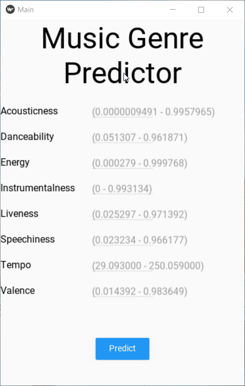

# Kivy Apps

This repo has:
- ML Model: Music Genre Classifier API files
- ML Model APK Files (Python file, buildozer spec & APK)
- Basic Auth APK Files (Python file, buildozer spec & APK)

### Article about how to build the Python App from scratch is live on [Analytics India Magazine](https://analyticsindiamag.com/deploying-machine-learning-models-in-android-apps-using-python/)

Here is the live demo of ML app:

API link: [Click me!](https://kivymlapp.herokuapp.com/)

~~It can be further exported to android app using buildozer.~~

The ML app is finally converted into APK! The file can be found in the APK folder. If you want to experience it on the web, head over to this link:
https://appetize.io/app/a8tez5nc93qyb9hhzj3k3y0ggc